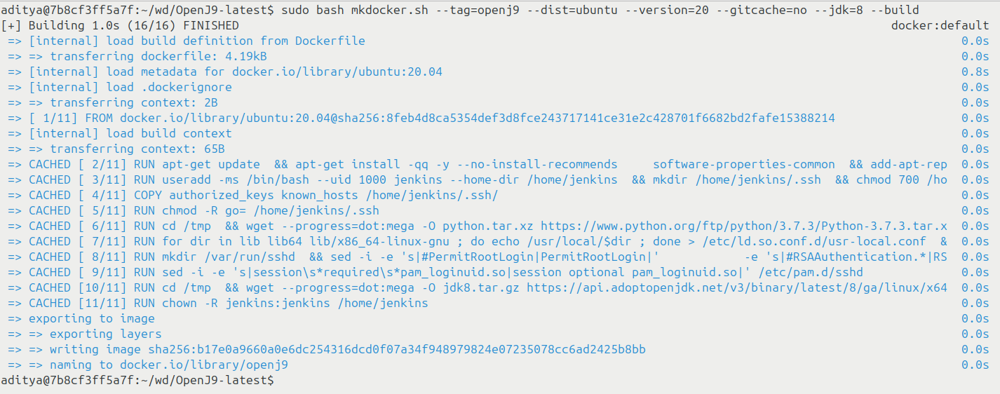
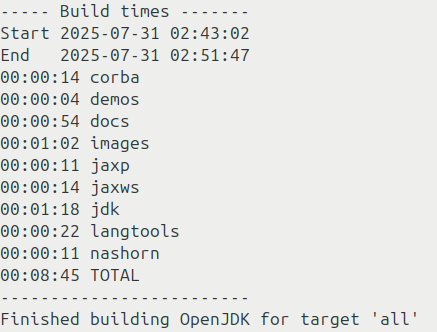

This document will guide you setup OpenJ9 VM on the CompL Server. Do let us know if you face any issues while setting up the server.
If you have already setup your working directory make sure you have selected `yes` for `docker in docker`.
> (4) Do you want to use docker inside docker [y/n]? y   
 See more details here: [Link](https://meetesh06.github.io/blog/CompL+IITB++Part+4++++Setting+up+Docker+Workspace/)

This list the steps for setting up openj9 with jdk8, just few changes required for setting it up for jdk 21:

Steps for Building

* Step 1: Download the docker build script :
`$ wget https://raw.githubusercontent.com/eclipse-openj9/openj9/master/buildenv/docker/mkdocker.sh`

* Step 2: Run the command to install all the requirements for openj9 :
`$ sudo bash mkdocker.sh --tag=openj9 --dist=ubuntu --version=20 --gitcache=no --jdk=8 --build`   (Use --jdk=21  for jdk21)

	You should get the following output. This step might take some time. [Max half an hour]

* Step 3: To keep the docker container on the host system as well. You can give path (<host_directory>) for the local directory where you want to keep openj9 :
`$ sudo docker run -u 0 -v <host_directory>:/src -it openj9` ("-u 0" may be required to git clone inside docker)

* Step 4: Clone the openj9 repo :
`$ cd /src`
`$ git clone https://github.com/ibmruntimes/openj9-openjdk-jdk8.git`  ( Use  $git clone https://github.com/ibmruntimes/openj9-openjdk-jdk21.git for jdk21)

* Step 5: Change the directory to openj9-openjdk-jdk8 or openj9-openjdk-jdk21 and fetch openj9 and omr using the script get_source.sh :
`$ cd openj9-openjdk-jdk8` (openj9-openjdk-jdk21 for jdk21)
`$ bash get_source.sh`

* Step 6: Switching to correct branch: (Fetching the branch is required only if we want to use our optimistic implementation)
`$ git remote add some_name <ssh_address_of_git_repo>`
`$ git remote -v`
`$ git fetch some_name <repo_name/branch>`
`$ git checkout branch`

* Step 7: Change directory to openj9-openjdk-jdk8 and run
`$ cd openj9-openjdk-jdk8`  or  `$ cd openj9-openjdk-jdk21`
`$ bash configure --with-boot-jdk=/home/jenkins/bootjdks/jdk8`  or `$ bash configure --with-boot-jdk=/home/jenkins/bootjdks/jdk20`

* Step 8: For debugging run this command
`$ bash configure --with-cmake --with-boot-jdk=/home/jenkins/bootjdks/jdk8 --with-native-debug-symbols=internal`  # use jdk20 for jdk21

* Step 9: Finally run
`$ make all`

	This will build openj9 for you.

	

To Set up OpenJ9 in VSCode with debugging: 

* https://blog.openj9.org/2020/11/19/setting-up-an-openj9-development-environment-with-visual-studio-code-docker-cmake/

